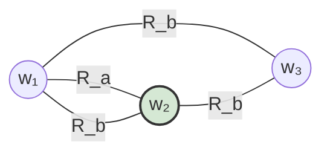

# Causal Reasoning Agent

An **LLM-agnostic agentic framework** for playing **social games**—games where communication, deception, coordination, and theory-of-mind matter as much as rules and moves. The design keeps model providers interchangeable so you can benchmark, swap backends, and reuse the same agent loop across environments.

## Team

- Mohammed Aksari  
- Helen Yuan  
- Kevin Nam  
- Kevin O'Connor  

---

## Quickstart

```bash
# 1. Clone and install dependencies
pip install -r requirements.txt

# 2. Set up API keys
cp .env.example .env
# fill in OPENAI_API_KEY, ANTHROPIC_API_KEY, or GOOGLE_API_KEY

# 3. Run the Werewolf demo
python -m examples.run_werewolf                          # MockLLM (no key needed)
python -m examples.run_werewolf --model openai           # GPT-4o
python -m examples.run_werewolf --model anthropic        # Claude
python -m examples.run_werewolf --model gemini           # Gemini
```

---

## Repository layout

```
causal_reasoning_agent/
├── causal_agent/          # framework package
│   ├── kripke.py          # World, KripkeModel — symbolic state + interventions
│   ├── llm.py             # BaseLLM, MockLLM, OpenAILLM, AnthropicLLM, GeminiLLM
│   ├── memory.py          # MemoryStore, KripkeSnapshot
│   ├── feedback.py        # FeedbackEvent, FeedbackProcessor
│   ├── planning.py        # Plan, Planner — Kripke-grounded reasoning
│   ├── acting.py          # GameAction, Actor — validates + packages actions
│   └── orchestration.py   # Orchestrator — session loop
├── games/
│   ├── base.py            # GameEnvironment ABC
│   └── werewolf/env.py    # toy Werewolf implementation
├── examples/
│   └── run_werewolf.py    # end-to-end demo
├── .env.example           # key template (copy → .env, never commit .env)
└── requirements.txt
```

---

## Supported LLM backends

| Flag | Class | SDK | Env var |
|---|---|---|---|
| `--model mock` | `MockLLM` | none | — |
| `--model openai` | `OpenAILLM` | `openai` | `OPENAI_API_KEY` |
| `--model anthropic` | `AnthropicLLM` | `anthropic` | `ANTHROPIC_API_KEY` |
| `--model gemini` | `GeminiLLM` | `google-generativeai` | `GOOGLE_API_KEY` |

All backends implement the same two-method interface:

```python
class BaseLLM(ABC):
    def complete(self, prompt: str, system: str = "", **kwargs) -> str: ...
```

Swapping backends is a one-line change; no other module is aware of which is in use.

---

## Architecture (five pillars)

Orchestration is the only module that touches all four pillars. Planning, Acting, Feedback, and Memory communicate exclusively through data objects — no cross-imports.

```
observe (env)
    ↓
Feedback  →  FeedbackEvent
    ↓
Memory    ←  add event + Kripke snapshot
    ↓
Kripke    ←  update_with_facts(event.facts)
    ↓
Planning  →  Plan   (reads KripkeModel + Memory)
    ↓
Acting    →  GameAction   (validates + packages Plan)
    ↓
env.step(action)  →  loops back
```

### Symbolic state and Kripke frames (planning–reasoning backbone)

Planning and reasoning are grounded in an explicit **symbolic state space**: a compact representation of what could be true about the game (roles, inventories, public commitments, and other propositions the environment makes meaningful). Natural language stays at the boundary; deliberation runs over this shared object so it remains inspectable and verifiable against rules.

**Interventions**—counterfactuals such as "what if I claimed this?" or "what if their role were X?"—are framed on a **Kripke model**: a set of **possible worlds** (complete coherent hypotheses), each assigning truth to atomic facts, together with an **accessibility relation** `R_a` per agent `a`. World `v` is `R_a`-accessible from `u` when, from everything `a` has observed in `u`, `a` cannot yet distinguish `v`. Announcing or observing new information **refines** accessibility (shrinks indistinguishable classes); interventions correspond to **restricting** which worlds remain or **updating** relations to reflect what others could know after a hypothetical move.

The LLM can still phrase plans in language, but the **grounding target** is this epistemic geometry: plans are chosen with respect to how interventions reshape what agents consider possible.

Toy picture — **worlds** are nodes; an edge labeled `R_a` means agent `a` cannot yet tell the two worlds apart. The highlighted node is the actual world.



Here `a` still confuses `w₁` with `w₂`, while `b`'s uncertainty links all three — typical of asymmetric information in social games. An **intervention** (speech, vote, reveal) is modeled by **deleting worlds** and **slicing edges** that contradict new information, then re-evaluating what each `R_a` permits.

### 1) Orchestration

**What it is:** The control loop that runs a session — turn order, environment ticks, when to call planning vs. acting, error handling, and lifecycle (setup, play, teardown).

**Why it matters for social games:** Games often have irregular phases (discussion, voting, private messages). Orchestration encodes *when* things happen and *who* acts, without baking in model-specific logic.

**Implementation:** `Orchestrator` holds references to all four modules and drives the observe → feedback → memory → plan → act loop. `AgentConfig` carries per-agent settings (goal string, max turns, replan-on-illegal flag).

### 2) Acting

**What it is:** Turning high-level decisions into concrete game actions — natural-language utterances, structured moves, tool calls, or API payloads the environment expects.

**Why it matters for social games:** The same strategic intent must be expressed differently in Werewolf vs. Diplomacy vs. negotiation sims. Acting is the adapter between *internal representation* and *environment format*.

**Implementation:** `Actor` validates `plan.action_type` against `valid_actions` before emitting a `GameAction`. On `ActionError`, Orchestration can request a replan. Post-processor hooks (e.g. `Actor.truncate_message()`) apply game-specific transforms after validation.

### 3) Planning

**What it is:** Reasoning over observations and goals to choose what to do next — single-shot plans, replanning after new information, or multi-step deliberation.

**Why it matters for social games:** Opponents are adaptive; plans must update when beliefs change. Planning stays model-agnostic by consuming the same Kripke and Memory abstractions regardless of which LLM implements the policy.

**Implementation:** Before each LLM call, `Planner` runs `simulate_intervention()` for each valid action — pure symbolic computation on the Kripke frame that quantifies how many worlds each move would eliminate and what new facts would become certain. Those summaries are embedded in the prompt so the LLM reasons about epistemic consequences, not just narrative plausibility.

### 4) Feedback

**What it is:** Closing the loop — rewards, win/loss, moderator messages, other players' replies, and structured signals from the environment (legal/illegal move, phase transition).

**Why it matters for social games:** Much of the signal is *social* — who trusted whom, who contradicted themselves — not a single scalar reward. Feedback normalizes diverse signals into forms the agent can learn from or log.

**Implementation:** `FeedbackProcessor.process()` converts raw environment dicts into typed `FeedbackEvent` objects (`OBSERVATION`, `REWARD`, `PHASE_CHANGE`, `SOCIAL`, `ILLEGAL_MOVE`, `TERMINAL`). The `facts` field on each event is what gets asserted into the KripkeModel.

### 5) Memory

**What it is:** What persists within a game and across episodes — transcripts, belief summaries, opponent models, and scratch notes the planner can query.

**Why it matters for social games:** Long discussions overflow context windows; memory chooses what to keep, compress, and retrieve.

**Implementation:** `MemoryStore` maintains a bounded short-term deque (rolling context window) and an unbounded long-term list. `KripkeSnapshot` objects record the epistemic state at each turn so belief evolution is traceable. The retrieval interface is recency-based by default — subclass and override `retrieve()` to plug in a vector store.

---

Together, **orchestration** sequences the loop, **planning** decides intent (over a **symbolic** model with **Kripke-style** counterfactuals), **acting** executes it, **feedback** updates the world model, and **memory** carries what matters forward — while the whole stack stays **LLM-agnostic** at the seams.
