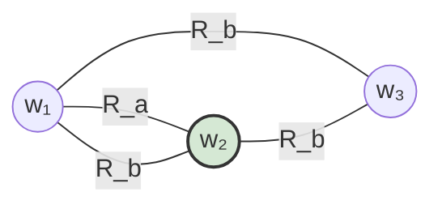

# Causal Reasoning Agent

An **LLM-agnostic agentic framework** for playing **social games**—games where communication, deception, coordination, and theory-of-mind matter as much as rules and moves. The design keeps model providers interchangeable so you can benchmark, swap backends, and reuse the same agent loop across environments.

## Team

- Mohammed Aksari  
- Helen Yuan  
- Kevin Nam  
- Kevin O'Connor  

## Architecture (five pillars)

The framework is organized around five responsibilities. Each can evolve independently (different planners, different memory stores) while sharing a common contract at the boundaries.

### Symbolic state and Kripke frames (planning–reasoning backbone)

We are tying **planning and reasoning** to an explicit **symbolic state space**: a compact representation of what could be true about the game (roles, inventories, public commitments, phase, and other propositions the environment or rules make meaningful). Natural language stays at the boundary; deliberation can run over this shared object so it stays inspectable and, in principle, verifiable against rules.

**Interventions**—counterfactuals such as “what if I claimed this?” or “what if their role were X?”—are then framed on a **Kripke model**: a set of **possible worlds** (complete coherent hypotheses), each assigning truth to atomic facts, together with an **accessibility relation** `R_a` per agent `a`. World `v` is `R_a`-accessible from `u` when, from everything `a` has observed in `u`, `a` cannot yet distinguish `v`. Announcing or observing new information **refines** accessibility (shrinks indistinguishable classes); some interventions correspond to **moving** the evaluation point, **restricting** which worlds remain, or **updating** relations to reflect what others could know after a hypothetical move.

The LLM can still phrase plans in language, but the **grounding target** is this epistemic geometry: plans are chosen with respect to how interventions reshape what agents consider possible.

Toy picture: **worlds** are nodes; an edge labeled `R_a` means agent `a` cannot (yet) tell the two worlds apart. Reflexive “I know where I am” loops are omitted. Highlighting marks the **actual** world for the story.

Here `a` still confuses `w₁` with `w₂`, while `b`’s uncertainty links all three—typical of asymmetric information in social games. An **intervention** (speech, vote, reveal) is modeled by **deleting worlds** and **slicing edges** that contradict the new public or private information, then re-evaluating what each `R_a` permits.

### 1) Orchestration

**What it is:** The control loop that runs a session—turn order, environment ticks, when to call planning vs. acting, error handling, and lifecycle (setup, play, teardown).

**Why it matters for social games:** Games often have irregular phases (discussion, voting, private messages). Orchestration encodes *when* things happen and *who* acts, without baking in model-specific logic.

**Design direction:** A thin runtime that composes the other pillars through stable interfaces (e.g., “observe state → plan → act → record feedback”) so swapping an LLM is a configuration change, not a rewrite.

### 2) Acting

**What it is:** Turning high-level decisions into concrete game actions: natural-language utterances, structured moves, tool calls, or API payloads the environment expects.

**Why it matters for social games:** The same strategic intent must be expressed differently in Werewolf vs. Diplomacy vs. negotiation sims. Acting is the adapter between *internal representation* and *environment format*.

**Design direction:** Action schemas per game, optional post-processing (length limits, tone), and validation before submission so invalid moves fail fast.

### 3) Planning

**What it is:** Reasoning over observations and goals to choose what to do next—single-shot plans, replanning after new information, or multi-step deliberation.

**Why it matters for social games:** Opponents are adaptive; plans must update when beliefs change. Planning stays model-agnostic by consuming the same state and memory abstractions regardless of which LLM implements the policy.

**Design direction:** Pluggable planners (reactive, chain-of-thought, tree search over speech acts) behind one interface; optional budget limits (tokens, wall clock, search depth). Where the symbolic layer exists, the planner should read/write that state (or its summaries) and treat **interventions as operations on the Kripke frame**—not only as narrative hypotheticals.

### 4) Feedback

**What it is:** Closing the loop: rewards, win/loss, moderator messages, other players’ replies, and structured signals from the environment (legal/illegal move, phase transition).

**Why it matters for social games:** Much of the signal is *social*—who trusted whom, who contradicted themselves—not a single scalar reward. Feedback normalizes diverse signals into forms the agent can learn from or log.

**Design direction:** Typed feedback events, hooks for human-in-the-loop critique, and clear separation between *environment truth* and *agent interpretation* (so hallucinated feedback is not confused with game state).

### 5) Memory

**What it is:** What persists within a game and across episodes: transcripts, belief summaries, opponent models, and scratch notes the planner can query.

**Why it matters for social games:** Long discussions overflow context windows; memory chooses what to keep, compress, and retrieve.

**Design direction:** Short-term (in-episode) vs. long-term (cross-match) stores, summarization policies, and retrieval that is game-aware (e.g., “votes in this round,” “claims about roles”) without coupling to a specific embedding or vector DB. Episodes that use the epistemic backbone should persist enough structure to **reconstruct or approximate** the current world set and accessibility relations after compressing raw chat.

---

Together, **orchestration** sequences the loop, **planning** decides intent (optionally over a **symbolic** model with **Kripke-style** counterfactuals), **acting** executes it, **feedback** updates the world model, and **memory** carries what matters forward—while the whole stack stays **LLM-agnostic** at the seams.
