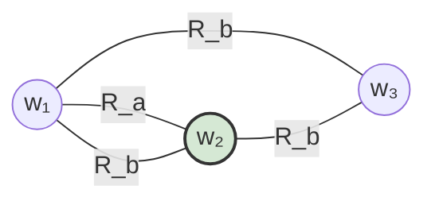

# Causal Reasoning Agent

An **LLM-agnostic agentic framework** for environments that require deliberate planning, multi-step reasoning, and grounded execution. The design keeps model providers interchangeable and evaluation environments pluggable — the same agent loop runs across social games, simulation evals, and any task that benefits from explicit epistemic state tracking.

## Team

- Mohammed Aksari  
- Helen Yuan  
- Kevin Nam  
- Kevin O'Connor  

---

## Quickstart

```bash
# 1. Clone and install dependencies
pip install -r requirements.txt

# 2. Set up API keys
cp .env.example .env
# fill in keys for whichever backends you want to use

# 3. Run the Werewolf demo
python -m examples.run_werewolf                          # MockLLM (no key needed)
python -m examples.run_werewolf --model openai           # GPT-4o
python -m examples.run_werewolf --model anthropic        # Claude
python -m examples.run_werewolf --model gemini           # Gemini
python -m examples.run_werewolf --model deepseek         # DeepSeek (cheap, good for testing)
```

---

## Repository layout

```
causal_reasoning_agent/
├── causal_agent/               # core framework package
│   ├── kripke.py               # World, KripkeModel — symbolic state + interventions
│   ├── kripke_tools.py         # KripkeToolset — KripkeModel ops as LLM-callable tools
│   ├── llm.py                  # BaseLLM + adapters: Mock, OpenAI, Anthropic, Gemini, DeepSeek
│   ├── tools.py                # ToolDefinition, ToolCall, LLMResponse, ToolRegistry
│   ├── memory.py               # MemoryStore, KripkeSnapshot
│   ├── feedback.py             # FeedbackEvent, FeedbackProcessor
│   ├── planning.py             # Plan, Planner — Kripke-grounded reactive planning
│   ├── acting.py               # GameAction, Actor — validates + packages actions
│   └── orchestration.py        # Orchestrator — reactive session loop
├── games/
│   ├── base.py                 # GameEnvironment ABC
│   └── werewolf/env.py         # Werewolf implementation
├── ksp_eval/                   # eval spec: mission instructions passed to the agent on init
│   └── ksp_mun_orbit_agent_instructions.md
├── skills/                     # reference docs injected into the agent's context
│   ├── orbital_mechanics.md
│   ├── mission_planning.md
│   ├── spacecraft_control.md
│   ├── krpc_basics.md
│   └── krpc_expressions.md
├── examples/
│   └── run_werewolf.py         # end-to-end demo
├── .env.example                # key template (copy → .env, never commit .env)
└── requirements.txt
```

---

## Supported LLM backends

| Flag | Class | SDK | Env var |
|---|---|---|---|
| `--model mock` | `MockLLM` | none | — |
| `--model openai` | `OpenAILLM` | `openai` | `OPENAI_API_KEY` |
| `--model anthropic` | `AnthropicLLM` | `anthropic` | `ANTHROPIC_API_KEY` |
| `--model gemini` | `GeminiLLM` | `google-generativeai` | `GOOGLE_API_KEY` |
| `--model deepseek` | `DeepSeekLLM` | `openai` (compat.) | `DEEPSEEK_API_KEY` |

All backends implement the same interface:

```python
class BaseLLM(ABC):
    # Standard single-turn completion
    def complete(self, prompt: str, system: str = "", **kwargs) -> str: ...

    # Tool-calling completion — native function calling on all real backends
    def complete_with_tools(
        self,
        messages: list[dict],   # full conversation history in OpenAI format
        registry: ToolRegistry, # tools available this turn
        system: str = "",
        **kwargs,
    ) -> LLMResponse: ...
```

`LLMResponse` carries either `tool_calls` (model wants to invoke a tool — caller executes and loops) or `content` (model is done). `DeepSeekLLM` reuses the `openai` SDK pointed at `https://api.deepseek.com/v1` — no extra dependency.

---

## Architecture

The framework has two orchestration layers. The **planning phase** handles deliberate preparation — research, world enumeration, sub-goal decomposition — before any action is taken. The **reactive loop** executes the resulting plan turn-by-turn against the environment.

### Two-level orchestration

```
┌──────────────────────────────────────────────────────────┐
│                    Meta-Orchestrator                     │
│            (manages phases + replanning loop)            │
│                                                          │
│  ┌──────────────────────────────────────────────────┐   │
│  │                 Planning Phase                   │   │
│  │         (recursive, tool-augmented ReAct)        │   │
│  │                                                  │   │
│  │  goal → decompose into sub-goals                 │   │
│  │       → call tools to fill knowledge gaps:       │   │
│  │           • external  — web_search, fetch_page   │   │
│  │           • epistemic — kripke_simulate,         │   │
│  │                         kripke_enumerate_worlds, │   │
│  │                         kripke_inspect_world … │   │
│  │       → recurse until confident                  │   │
│  │       → emit Plan artifact                       │   │
│  └──────────────────────────────────────────────────┘   │
│                          ↓                               │
│  ┌──────────────────────────────────────────────────┐   │
│  │               Execution Phase                    │   │
│  │           (reactive Orchestrator loop)           │   │
│  │                                                  │   │
│  │  Plan → observe → feedback → memory              │   │
│  │       → Kripke update → plan → act               │   │
│  │       → env.step → loop                          │   │
│  └──────────────────────────────────────────────────┘   │
│                          ↓                               │
│               result → replan? → loop                    │
└──────────────────────────────────────────────────────────┘
```

The planning phase is **eval-agnostic** — it knows only a goal, a `ToolRegistry`, and an optional skill library. Evals inject their own tools and reference docs at init; the core framework has no knowledge of any specific domain.

---

## Tool system

Tools are the mechanism by which the agent extends its own reasoning — both outward into the world (research) and inward into its own belief state (epistemic inspection). All tools share the same `ToolRegistry` / `ToolDefinition` / `ToolCall` interface; the planning loop calls `complete_with_tools()` and dispatches results the same way regardless of tool type.

### External tools (research)

The agent can search and read during planning. Tools are registered per eval; evals that need no research register none.

| Tool | Purpose | Backend |
|---|---|---|
| `web_search(query)` | Search the web for documentation, data, forum posts, etc. | Tavily API (`TAVILY_API_KEY`) |
| `fetch_page(url)` | Read a specific URL as clean markdown | Jina Reader (no key needed) |

### Epistemic tools (`KripkeToolset`)

Rather than receiving a pre-baked summary of the world space, the LLM can actively explore its belief state — querying only the hypotheticals it finds relevant. `KripkeToolset` wraps the live `KripkeModel` as a set of callable tools and registers them into the `ToolRegistry` alongside any external tools.

| Tool | What the LLM can ask |
|---|---|
| `kripke_certain_facts` | "What do I already know for certain?" |
| `kripke_count_worlds` | "How many scenarios are still consistent with X?" |
| `kripke_enumerate_worlds` | "Show me worlds where fuel margin is sufficient" |
| `kripke_inspect_world` | "Give me the full detail on world w14" |
| `kripke_simulate_intervention` | "If I assert this fact, what worlds survive and what becomes certain?" |
| `kripke_compare_interventions` | "Which of these two actions is epistemically better?" |
| `kripke_worlds_reaching_goal` | "How many current worlds already satisfy the goal?" |

The toolset takes a getter `lambda: current_model` so it always reflects the latest model state as the orchestrator processes new observations:

```python
model_ref = [initial_kripke]
toolset = KripkeToolset(lambda: model_ref[0])
toolset.register_all(registry)

# When the model updates after an observation:
model_ref[0] = model_ref[0].update_with_facts(new_facts)
# All Kripke tools now operate on the updated model automatically
```

### Skill library

`skills/` contains Markdown reference documents injected into the agent's context at init time. Skills are passive — the LLM decides when and how to use them. They are reference material, not eval-specific logic.

### Eval specs

`ksp_eval/` (and future eval directories) contain only the **mission instructions and scoring rubric** passed to the agent as its initial prompt. There is no eval-specific agent code. The agent determines what tools and sub-goals are necessary from those instructions alone.

---

## Symbolic state and Kripke frames

Planning and reasoning are grounded in an explicit **symbolic state space**: a compact representation of what could be true about the environment. Natural language stays at the boundary; deliberation runs over this shared object so it remains inspectable and verifiable.

**Interventions** — counterfactuals such as "what if I took this action?" — are framed on a **Kripke model**: a set of **possible worlds** (complete coherent hypotheses), each assigning truth values to atomic facts, together with an **accessibility relation** `R_a` per agent `a`. World `v` is `R_a`-accessible from `u` when agent `a` cannot yet distinguish `v` from `u`. Observing new information **refines** accessibility (shrinks indistinguishable classes); interventions **restrict** which worlds remain or **update** relations to reflect what others could know after a hypothetical move.



Here `a` still confuses `w₁` with `w₂`, while `b`'s uncertainty links all three. An **intervention** is modeled by **deleting worlds** and **slicing edges** that contradict new information, then re-evaluating what each `R_a` permits.

The `KripkeToolset` exposes this geometry directly to the LLM as callable tools, so the agent can actively explore the world space during planning rather than receiving a static summary. The epistemic search — which worlds survive a hypothetical? which worlds reach the goal? — is driven by the LLM, not pre-computed by the planner.

---

## The five pillars (reactive loop)

Orchestration is the only module that touches all pillars. Planning, Acting, Feedback, and Memory communicate exclusively through data objects — no cross-imports.

```
observe (env)
    ↓
Feedback  →  FeedbackEvent
    ↓
Memory    ←  add event + Kripke snapshot
    ↓
Kripke    ←  update_with_facts(event.facts)
    ↓
Planning  →  Plan   (reads KripkeModel + Memory)
    ↓
Acting    →  GameAction   (validates + packages Plan)
    ↓
env.step(action)  →  loops back
```

### 1) Orchestration
Control loop for a session — turn order, environment ticks, when to call planning vs. acting, error handling, lifecycle. `AgentConfig` carries per-agent settings (goal string, max turns, replan-on-illegal flag).

### 2) Acting
Turns high-level decisions into concrete environment actions. `Actor` validates `plan.action_type` against `valid_actions` before emitting a `GameAction`. Post-processor hooks apply environment-specific transforms after validation.

### 3) Planning
Reasons over observations and goals to choose what to do next. In the reactive loop, `Planner` calls the LLM with a Kripke summary and memory context. In the planning phase, the same LLM drives an active epistemic search via `KripkeToolset` and any registered external tools.

### 4) Feedback
Closes the loop. `FeedbackProcessor.process()` converts raw environment dicts into typed `FeedbackEvent` objects (`OBSERVATION`, `REWARD`, `PHASE_CHANGE`, `SOCIAL`, `ILLEGAL_MOVE`, `TERMINAL`). The `facts` field on each event is asserted into the KripkeModel.

### 5) Memory
What persists within a session and across episodes. `MemoryStore` maintains a bounded short-term deque and an unbounded long-term list. `KripkeSnapshot` records epistemic state at each turn so belief evolution is traceable. Override `retrieve()` to plug in a vector store.

---

Together, the **planning phase** prepares a grounded plan through recursive research and world-space exploration; the **reactive loop** executes it turn-by-turn against the environment; and the **meta-orchestrator** ties replanning to execution outcomes — while the whole stack stays **LLM-agnostic** and **eval-agnostic** at every seam.
