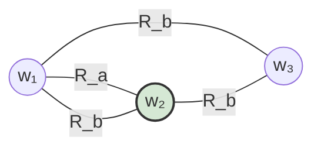

# Causal Reasoning Agent

An **LLM-agnostic agentic framework** for environments that require deliberate planning, multi-step reasoning, grounded execution, and structured actions. It supports social games such as Werewolf, puzzle games such as 2048 and Mastermind, simulation evals, and any task that benefits from explicit epistemic state tracking. The design keeps model providers interchangeable and evaluation environments pluggable.

## Team

- Mohammed Aksari  
- Helen Yuan  
- Kevin Nam  
- Kevin O'Connor  

---

## Quickstart

```bash
# 1. Clone and install dependencies
pip install -r requirements.txt

# 2. Set up API keys
cp .env.example .env
# fill in keys for whichever backends you want to use

# 3. Run the Werewolf demo
python -m examples.run_werewolf                          # MockLLM (no key needed)
python -m examples.run_werewolf --model openai           # GPT-4o
python -m examples.run_werewolf --model anthropic        # Claude
python -m examples.run_werewolf --model gemini           # Gemini
python -m examples.run_werewolf --model deepseek         # DeepSeek (cheap, good for testing)
python -m examples.run_2048                              # 2048 with MockLLM
python -m examples.run_mastermind                         # Mastermind with MockLLM
```

---

## Repository layout

```
causal_reasoning_agent/
├── causal_agent/               # core framework package
│   ├── kripke.py               # World, KripkeModel — symbolic state + interventions
│   ├── kripke_tools.py         # KripkeToolset — KripkeModel ops as LLM-callable tools
│   ├── llm.py                  # BaseLLM + adapters: Mock, OpenAI, Anthropic, Gemini, DeepSeek
│   ├── actions.py              # ActionSpec — Pydantic-backed game action schemas
│   ├── prompts.py              # PLANNING_SYSTEM, REACTIVE_SYSTEM — boilerplate init prompts
│   ├── tools.py                # ToolDefinition, ToolCall, LLMResponse, ToolRegistry
│   ├── research_tools.py       # ResearchTools — Tavily (web_search) + Jina (fetch_page)
│   ├── research_planner.py     # ResearchPlanner — ReAct planning loop, PlanningResult
│   ├── human_interface.py      # HumanInterface — human_notify / human_ask / human_confirm
│   ├── memory.py               # MemoryStore, KripkeSnapshot
│   ├── feedback.py             # FeedbackEvent, FeedbackProcessor
│   ├── planning.py             # Plan, Planner — Kripke-grounded reactive planning
│   ├── acting.py               # GameAction, Actor — validates + packages actions
│   ├── orchestration.py        # Orchestrator — reactive session loop
│   └── log_config.py           # setup_logging(), get_logger()
├── games/
│   ├── base.py                 # GameEnvironment ABC
│   ├── werewolf/env.py         # Werewolf implementation
│   ├── game_2048/env.py        # 2048 implementation
│   └── mastermind/env.py       # Mastermind implementation
├── ksp_eval/                   # eval spec: mission instructions passed to the agent on init
│   └── ksp_mun_orbit_agent_instructions.md
├── skills/                     # reference docs injected into the agent's context
│   ├── orbital_mechanics.md
│   ├── mission_planning.md
│   ├── spacecraft_control.md
│   ├── krpc_basics.md
│   └── krpc_expressions.md
├── examples/
│   ├── run_werewolf.py         # end-to-end demo
│   ├── run_2048.py             # 2048 demo
│   └── run_mastermind.py       # Mastermind demo
├── .env.example                # key template (copy → .env, never commit .env)
└── requirements.txt
```

---

## Supported LLM backends

| Flag | Class | SDK | Env var |
|---|---|---|---|
| `--model mock` | `MockLLM` | none | — |
| `--model openai` | `OpenAILLM` | `openai` | `OPENAI_API_KEY` |
| `--model anthropic` | `AnthropicLLM` | `anthropic` | `ANTHROPIC_API_KEY` |
| `--model gemini` | `GeminiLLM` | `google-generativeai` | `GOOGLE_API_KEY` |
| `--model deepseek` | `DeepSeekLLM` | `openai` (compat.) | `DEEPSEEK_API_KEY` |

All backends implement the same text interface, can optionally use provider-native tool calling, and can request provider-native structured outputs:

```python
class BaseLLM(ABC):
    # Standard single-turn completion
    def complete(self, prompt: str, system: str = "", **kwargs) -> str: ...

    # Tool-calling completion — native function calling on all real backends
    def complete_with_tools(
        self,
        messages: list[dict],   # full conversation history in OpenAI format
        registry: ToolRegistry, # tools available this turn
        system: str = "",
        **kwargs,
    ) -> LLMResponse: ...

    # Structured completion — provider-native schema mode where available
    def complete_structured(self, prompt: str, schema: dict, system: str = "", **kwargs) -> dict: ...
```

`LLMResponse` carries either `tool_calls` (model wants to invoke a tool — caller executes and loops) or `content` (model is done). Every backend logs completions via the framework logger — see **Logging** below. `DeepSeekLLM` reuses the `openai` SDK pointed at `https://api.deepseek.com/v1` — no extra dependency.

---

## Architecture

The framework has two orchestration layers. The **planning phase** handles deliberate preparation — research, world enumeration, sub-goal decomposition — before any action is taken. The **reactive loop** executes the resulting plan turn-by-turn against the environment.

### Two-level orchestration

```
┌──────────────────────────────────────────────────────────┐
│                    Meta-Orchestrator                     │
│            (manages phases + replanning loop)            │
│                                                          │
│  ┌──────────────────────────────────────────────────┐   │
│  │                 Planning Phase                   │   │
│  │         (recursive, tool-augmented ReAct)        │   │
│  │                                                  │   │
│  │  goal → decompose into sub-goals                 │   │
│  │       → call tools to fill knowledge gaps:       │   │
│  │           • research   — web_search, fetch_page  │   │
│  │           • epistemic  — kripke_simulate,        │   │
│  │                          kripke_enumerate_worlds │   │
│  │           • human      — human_notify, human_ask │   │
│  │       → recurse until confident                  │   │
│  │       → emit Plan artifact                       │   │
│  └──────────────────────────────────────────────────┘   │
│                          ↓                               │
│  ┌──────────────────────────────────────────────────┐   │
│  │               Execution Phase                    │   │
│  │           (reactive Orchestrator loop)           │   │
│  │                                                  │   │
│  │  Plan → observe → feedback → memory              │   │
│  │       → Kripke update → plan → act               │   │
│  │       → env.step → loop                          │   │
│  └──────────────────────────────────────────────────┘   │
│                          ↓                               │
│               result → replan? → loop                    │
└──────────────────────────────────────────────────────────┘
```

The planning phase is **eval-agnostic** — it knows only a goal, a `ToolRegistry`, and an optional skill library. Evals inject their own tools and reference docs at init; the core framework has no knowledge of any specific domain.

### Minimal wiring

```python
from causal_agent import (
    setup_logging, DeepSeekLLM, ToolRegistry,
    ResearchTools, KripkeToolset, HumanInterface,
    ResearchPlanner, MemoryStore,
)

setup_logging("INFO")          # or "DEBUG" to see full prompts + responses

llm      = DeepSeekLLM()
memory   = MemoryStore()       # shared across planning + execution + all attempts
registry = ToolRegistry()

ResearchTools().register_all(registry)               # web_search, fetch_page
KripkeToolset(lambda: model_ref[0]).register_all(registry)  # kripke_*
HumanInterface().register_all(registry)              # human_notify, human_ask, human_confirm

planner = ResearchPlanner(
    llm=llm,
    registry=registry,
    system_prompt=eval_instructions,   # loaded from ksp_eval/ or similar
    skill_docs=skill_docs,             # loaded from skills/
    memory=memory,
)
result = planner.run(goal="Achieve a stable Mun orbit")
print(result.plan)
```

---

## Tool system

Tools are the mechanism by which the agent extends its own reasoning — outward into the world (research), inward into its belief state (epistemic), and outward to the human operator. All tools share the same `ToolRegistry` / `ToolDefinition` / `ToolCall` interface; the planning loop calls `complete_with_tools()` and dispatches results identically regardless of tool type.

### Research tools

| Tool | Purpose | Backend |
|---|---|---|
| `web_search(query)` | Search the web for documentation, data, forum posts, etc. | Tavily API (`TAVILY_API_KEY`) |
| `fetch_page(url)` | Read a specific URL as clean markdown | Jina Reader (no key needed) |

### Epistemic tools (`KripkeToolset`)

Rather than receiving a pre-baked summary of the world space, the LLM actively explores its belief state — querying only the hypotheticals it finds relevant.

| Tool | What the LLM can ask |
|---|---|
| `kripke_certain_facts` | "What do I already know for certain?" |
| `kripke_count_worlds` | "How many scenarios are still consistent with X?" |
| `kripke_enumerate_worlds` | "Show me worlds where fuel margin is sufficient" |
| `kripke_inspect_world` | "Give me the full detail on world w14" |
| `kripke_simulate_intervention` | "If I assert this fact, what worlds survive and what becomes certain?" |
| `kripke_compare_interventions` | "Which of these two actions is epistemically better?" |
| `kripke_worlds_reaching_goal` | "How many current worlds already satisfy the goal?" |

The toolset takes a getter so it always reflects the latest model state:

```python
model_ref = [initial_kripke]
KripkeToolset(lambda: model_ref[0]).register_all(registry)

model_ref[0] = model_ref[0].update_with_facts(new_facts)  # tools update automatically
```

### Human interface tools

The agent communicates with the human operator using the same tool mechanism — human interactions are first-class and appear in the planning log alongside research and epistemic calls.

| Tool | Behaviour |
|---|---|
| `human_notify(message)` | Display a message to the operator; don't wait |
| `human_ask(question)` | Display a question; block until the operator types a response |
| `human_confirm(message)` | Display a request; block until the operator types yes/no |

```python
HumanInterface().register_all(registry)                        # CLI — real operator
HumanInterface("silent", silent_response="ready").register_all(registry)  # automated / test
```

### Skill library

`skills/` contains Markdown reference documents injected into the agent's context at init time. Skills are passive — the LLM decides when and how to use them. They are reference material, not eval-specific logic.

### Eval specs

`ksp_eval/` (and future eval directories) contain only the **mission instructions and scoring rubric** passed to the agent as its initial system prompt. There is no eval-specific agent code. The agent determines what tools and sub-goals are necessary from those instructions alone.

---

## Logging

All LLM completions and tool activity are routed through Python's `logging` module under the `causal_agent` namespace. Call `setup_logging()` once at the top of any entry point.

```python
from causal_agent import setup_logging

setup_logging("INFO")                        # summaries: model, char counts, tool names
setup_logging("DEBUG")                       # full prompts, full responses, all tool content
setup_logging("INFO", log_file="run.log")    # mirror output to a file (append mode)
```

| Level | What you see |
|---|---|
| `DEBUG` | Full prompt text, full response text, all tool arguments and results |
| `INFO` | Completion summaries (`DeepSeekLLM ← [complete] 3,412 chars`), tool call names, planning iteration counter, final plan char count |
| `WARNING` | Recoverable issues — replan triggered, max iterations hit |
| `ERROR` | Unrecoverable failures |

---

## System prompts

`causal_agent/prompts.py` provides two ready-made system prompts. Import whichever you need — or concatenate your own eval-specific addendum.

| Constant | Used by | What it covers |
|---|---|---|
| `PLANNING_SYSTEM` | `ResearchPlanner` (default) | Framework overview, all three tool categories with usage guidance, a five-step goal-navigation strategy, stopping criteria, and output format expectations |
| `REACTIVE_SYSTEM` | `Planner` (default) | Turn-by-turn reactive planning over a Kripke summary; instructs the model to output strict JSON (`intent`, `action_type`, `parameters`, `reasoning`) |

Both are **task-agnostic** by design. Eval-specific context goes in an addendum, not in the base prompt:

```python
from causal_agent.prompts import PLANNING_SYSTEM

ksp_system = PLANNING_SYSTEM + """

## Eval-specific constraints
- You are controlling a rocket in Kerbal Space Program via kRPC.
- Your final output must include a rocket manifest and a flight script.
- All delta-V figures should be verified against the Mun transfer window.
"""

planner = ResearchPlanner(llm=llm, registry=registry, system_prompt=ksp_system)
```

The prompts are plain strings — feel free to inspect or print them before a run to verify what the model sees.

---

## Symbolic state and Kripke frames

Planning and reasoning can be grounded in an explicit **symbolic state space**: a compact representation of what could be true about the environment. Natural language stays at the boundary; deliberation runs over this shared object so it remains inspectable and verifiable. Fully observable puzzle games can use the default trivial one-world model and skip intervention simulation.

**Interventions** — counterfactuals such as "what if I took this action?" — are framed on a **Kripke model**: a set of **possible worlds** (complete coherent hypotheses), each assigning truth values to atomic facts, together with an **accessibility relation** `R_a` per agent `a`. World `v` is `R_a`-accessible from `u` when agent `a` cannot yet distinguish `v` from `u`. Observing new information **refines** accessibility (shrinks indistinguishable classes); interventions **restrict** which worlds remain or **update** relations to reflect what others could know after a hypothetical move.



Here `a` still confuses `w₁` with `w₂`, while `b`'s uncertainty links all three. An **intervention** is modeled by **deleting worlds** and **slicing edges** that contradict new information, then re-evaluating what each `R_a` permits.

`KripkeToolset` exposes this geometry directly to the LLM as callable tools, so the agent actively explores the world space during planning rather than receiving a static summary. The epistemic search — which worlds survive a hypothetical? which worlds reach the goal? — is driven by the LLM, not pre-computed by the planner.

---

## The five pillars (reactive loop)

Orchestration is the only module that touches all pillars. Planning, Acting, Feedback, and Memory communicate exclusively through data objects — no cross-imports.

```
observe (env)
    ↓
Feedback  →  FeedbackEvent
    ↓
Memory    ←  add event + Kripke snapshot
    ↓
Kripke    ←  update_with_facts(event.facts)
    ↓
Planning  →  Plan   (reads KripkeModel + Memory)
    ↓
Acting    →  GameAction   (validates + packages Plan)
    ↓
env.step(action)  →  loops back
```

### 1) Orchestration
Control loop for a session — turn order, environment ticks, when to call planning vs. acting, error handling, lifecycle. `AgentConfig` carries per-agent settings (goal string, max turns, replan-on-illegal flag).

### 2) Acting
Turns high-level decisions into concrete environment actions. Each environment exposes `ActionSpec` objects with Pydantic payload models; `Actor` validates both `plan.action_type` and `plan.parameters` before emitting a `GameAction`. Post-processor hooks apply environment-specific transforms after validation.

### 3) Planning
Reasons over observations and goals to choose what to do next. In the reactive loop, `Planner` calls the LLM with a Kripke summary and memory context. In the planning phase, `ResearchPlanner` drives an active epistemic and research loop via the full `ToolRegistry`.

### 4) Feedback
Closes the loop. `FeedbackProcessor.process()` converts raw environment dicts into typed `FeedbackEvent` objects (`OBSERVATION`, `REWARD`, `PHASE_CHANGE`, `SOCIAL`, `ILLEGAL_MOVE`, `TERMINAL`). The `facts` field on each event is asserted into the KripkeModel.

### 5) Memory
What persists within a session and across episodes. `MemoryStore` maintains a bounded short-term deque and an unbounded long-term list. `KripkeSnapshot` records epistemic state at each turn so belief evolution is traceable. Override `retrieve()` to plug in a vector store.

A single `MemoryStore` instance should be threaded through the **entire eval** — planning phase, execution phase, and across all attempts. `ResearchPlanner` logs every tool call and the final plan into it; `Orchestrator` logs observations, actions, and feedback. When attempt N fails, the post-mortem is written as a `"reflection"` entry; attempt N+1's planning phase reads `short_term_context()` and skips re-researching what it already knows.

Between attempts, call `memory.summarise_episode(llm)` to compress the full log into a paragraph for seeding the next planning cycle. The optional `prompt_template` parameter (with a `{log}` placeholder) allows eval-specific summarisation instructions.

---

Together, the **planning phase** prepares a grounded plan through recursive research and world-space exploration; the **reactive loop** executes it turn-by-turn against the environment; and the **meta-orchestrator** ties replanning to execution outcomes — while the whole stack stays **LLM-agnostic** and **eval-agnostic** at every seam.
